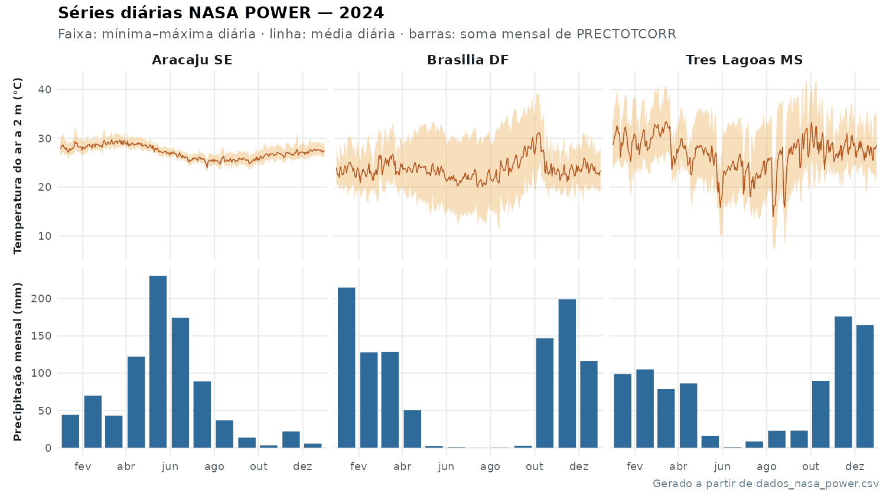

<div align="center">

# nasa-power-batch

### Download em lote de **dados meteorológicos diários da NASA POWER** para uma lista de estações ou pontos

*Uma planilha com as suas estações entra; uma série diária pronta para regressão com os dados medidos in loco sai.*

[](https://github.com/igorleite91/nasa-power-batch/actions/workflows/verificacao.yml)
[](https://www.r-project.org/)
[](https://httr2.r-lib.org/)
[](https://power.larc.nasa.gov/)
[](LICENSE)
[](#)

**[Português](README.md)** · [English](README.en.md)

</div>

---

<div align="center">

<sub><i>Resultado real: as três estações de <code>exemplos/estacoes.csv</code>, ano de 2024, baixadas pelo script e plotadas com <code>docs/gerar_figura.R</code>.</i></sub>
</div>

---

## O problema

A [NASA POWER](https://power.larc.nasa.gov/) oferece séries diárias globais e gratuitas de
temperatura, umidade, vento, radiação e chuva desde 1981 — um ótimo substituto quando não há
estação meteorológica perto da área de estudo, ou quando a estação tem falhas. Mas o
[visualizador web](https://power.larc.nasa.gov/data-access-viewer/) trabalha **um ponto por
vez**. Com dezenas de fazendas, talhões, parcelas ou estações, isso vira uma tarde de
cliques e copia-e-cola.

Este repositório lê uma tabela de pontos e baixa tudo de uma vez, com os cuidados que um
lote longo exige.

## O que este código faz

1. Lê a tabela de estações (`.csv` ou `.xlsx`) e **valida antes de baixar**: colunas,
   coordenadas, datas (inclusive `dd/mm/aaaa`), início ≥ 1981, IDs repetidos. O erro aponta a
   linha exata.
2. Consulta a [API diária da POWER](https://power.larc.nasa.gov/docs/services/api/temporal/daily/)
   para cada ponto, com **limite de 1 requisição/s** e **novas tentativas automáticas** em
   falhas transitórias (HTTP 429/5xx).
3. **Converte o valor de preenchimento `-999` em `NA`.** A API usa `-999` para dias ainda não
   processados (os últimos dias antes da data atual) ou sem dado; se ele passar despercebido,
   derruba qualquer média ou soma.
4. Guarda **cache por estação**: se a internet cair no meio do lote, rodar de novo retoma de
   onde parou. O cache é invalidado se o período, as coordenadas ou as variáveis mudarem.
5. Se uma estação falhar, **o lote continua** e a falha vai para `*_falhas.csv`, com a
   mensagem de erro da própria API.
6. Grava **um único CSV** (UTF-8), uma linha por estação × dia.

## Começando em 3 minutos

```bash
git clone https://github.com/igorleite91/nasa-power-batch.git
cd nasa-power-batch
Rscript -e 'install.packages(c("httr2", "jsonlite", "readxl"), repos = "https://cloud.r-project.org")'

# baixa 2024 inteiro para as 3 estações de exemplo
Rscript baixar_nasa_power.R
```

Saída esperada em `saida/dados_nasa_power.csv` — 1 098 linhas (3 estações × 366 dias):

| id_da_estacao | Date | T2M | T2M_MIN | T2M_MAX | PRECTOTCORR | … | elevacao_m |
|---|---|---|---|---|---|---|---|
| Aracaju_SE | 2024-01-01 | 27.88 | 26.51 | 29.54 | 0.07 | … | 12.7 |
| Aracaju_SE | 2024-01-02 | 28.04 | 26.60 | 29.84 | 0.08 | … | 12.7 |
| Aracaju_SE | 2024-01-03 | 28.45 | 26.95 | 30.56 | 1.79 | … | 12.7 |
| … | | | | | | | |

*(valores reais da API, versão v2.10.0, consultados em 30/09/2026)*

Prefere o RStudio? Abra `baixar_nasa_power.R`, ajuste `ARQUIVO_ESTACOES` e `ARQUIVO_SAIDA`
no topo e clique em **Source**.

### Usando os seus dados

```bash
Rscript baixar_nasa_power.R minhas_estacoes.xlsx resultado/clima.csv

# só temperatura e chuva
Rscript baixar_nasa_power.R minhas_estacoes.csv clima.csv --parametros=T2M,T2M_MIN,T2M_MAX,PRECTOTCORR

# todas as opções
Rscript baixar_nasa_power.R --ajuda
```

## A tabela de estações

Uma linha por ponto. Os nomes das colunas precisam ser exatamente estes (outras colunas
são ignoradas):

| Coluna | Exemplo | Observação |
|---|---|---|
| `id_da_estacao` | `Aracaju_SE` | único na tabela; vira nome do arquivo de cache |
| `latitude` | `-10.95` | graus decimais, sul negativo |
| `longitude` | `-37.05` | graus decimais, oeste negativo |
| `data_inicio` | `2024-01-01` | `aaaa-mm-dd`, `dd/mm/aaaa` ou célula de data do Excel; ≥ 1981-01-01 |
| `data_fim` | `2024-12-31` | mesmo formato; ≥ `data_inicio` |

Veja [`exemplos/estacoes.csv`](exemplos/estacoes.csv). Em `.xlsx`, a primeira aba é lida.

> [!TIP]
> Salvando CSV pelo Excel em português, escolha **"CSV UTF-8 (delimitado por vírgulas)"** e
> use **ponto** como separador decimal nas coordenadas. Na dúvida, use o `.xlsx` direto.

## As variáveis

O conjunto padrão reúne **exatamente o que a evapotranspiração de referência FAO-56
Penman-Monteith precisa** — incluindo a radiação no topo da atmosfera (Rₐ) e a altitude:

| Coluna | Unidade | Descrição |
|---|---|---|
| `TOA_SW_DWN` | MJ/m²/dia | Irradiância de onda curta no topo da atmosfera |
| `ALLSKY_SFC_SW_DWN` | MJ/m²/dia | Irradiância de onda curta na superfície (céu real) |
| `T2M` | °C | Temperatura média do ar a 2 m |
| `T2M_MIN` | °C | Temperatura mínima a 2 m |
| `T2M_MAX` | °C | Temperatura máxima a 2 m |
| `RH2M` | % | Umidade relativa a 2 m |
| `WS2M` | m/s | Velocidade do vento a 2 m |
| `PRECTOTCORR` | mm/dia | Precipitação corrigida |
| `elevacao_m` | m | Altitude da célula da grade, informada pela API |

Qualquer outra variável da POWER pode ser pedida com `--parametros=` (máximo de 20 por
requisição). A lista completa está no
[dicionário de parâmetros](https://power.larc.nasa.gov/parameters/). A comunidade
(`--comunidade=AG`, `RE` ou `SB`) muda apenas as unidades de algumas variáveis de radiação;
`AG` é a indicada para agronomia.

## Pareando com estações in loco (regressão)

O uso que motivou este repositório: baixar a POWER **nas mesmas coordenadas das suas
estações meteorológicas** e ajustar uma regressão entre o dado medido e o de grade. Com o
modelo calibrado dá para corrigir o viés da POWER, preencher falhas da estação e estender a
série para antes da instalação do equipamento.

Como o `id_da_estacao` e a `Date` da saída são as chaves, o pareamento é um `merge`:

```r
power <- read.csv("saida/dados_nasa_power.csv")
power$Date <- as.Date(power$Date)

obs <- read.csv("minhas_medicoes.csv")   # id_da_estacao, Date, T2M_obs
obs$Date <- as.Date(obs$Date)

pares <- merge(obs, power, by = c("id_da_estacao", "Date"))

# Calibração por estação: separa o último ano para validar fora da amostra
ajusta <- function(d) {
  corte  <- max(d$Date) - 365
  treino <- d[d$Date <= corte, ]
  teste  <- d[d$Date >  corte, ]
  m      <- lm(T2M_obs ~ T2M, data = treino)
  pred   <- predict(m, newdata = teste)
  data.frame(
    id_da_estacao = d$id_da_estacao[1],
    n_treino      = nrow(treino),
    intercepto    = coef(m)[[1]],
    inclinacao    = coef(m)[[2]],
    r2_treino     = summary(m)$r.squared,
    rmse_teste    = sqrt(mean((teste$T2M_obs - pred)^2, na.rm = TRUE)),
    vies_power    = mean(d$T2M - d$T2M_obs, na.rm = TRUE)  # POWER − estação
  )
}
do.call(rbind, lapply(split(pares, pares$id_da_estacao), ajusta))
```

Três cuidados que mudam o resultado:

- **Valide fora da amostra, separando por tempo** (como acima), não por sorteio de dias: dias
  vizinhos são autocorrelacionados e um sorteio infla o R².
- **Chuva diária não se ajusta bem por regressão linear.** Pareie em acumulados (5 dias,
  decêndio, mês) ou use mapeamento de quantis; temperatura, umidade e radiação costumam
  responder bem ao ajuste diário.
- **Os `NA` da POWER e da estação são descartados pelo `lm()`**, então confira o `n` de cada
  ajuste antes de comparar estações.

## Precisão e limitações

Vale ser explícito sobre o que esses dados são e o que não são:

- **Não são medições de estação.** São produtos de reanálise e satélite em grade: meteorologia
  do MERRA-2 (~0,5° × 0,625°, cerca de 55 × 70 km no equador) e radiação do CERES/FLASHFlux
  (~1°). Um ponto representa a **célula** onde cai, não o local exato. Relevo acidentado,
  litoral e ilhas de calor urbanas não são bem representados.
- **Chuva é a variável mais incerta.** `PRECTOTCORR` é corrigida com pluviômetros, mas
  eventos convectivos locais e extremos diários tendem a ser suavizados. Para balanço hídrico
  fino, compare com estações do INMET/ANA da região.
- **Dias recentes chegam como `NA`.** Os últimos dias antes da consulta ainda não foram
  processados e vêm como `-999` da API — este código os converte em `NA`. Baixe de novo mais
  tarde se precisar deles.
- **Horário local solar (LST).** O dia é definido pelo horário solar local do ponto, não UTC.
- **Nomes de coluna mantidos da versão original.** `Date` e `id_da_estacao` continuam iguais
  aos do script que deu origem ao repositório, para não quebrar planilhas e rotinas já em
  uso. `elevacao_m` é nova e vem no fim.

## Aplicações

- **Evapotranspiração de referência (ET₀)** e balanço hídrico de culturas
- **Silvicultura e agricultura** — covariáveis climáticas para modelos de crescimento e
  produtividade
- **Sensoriamento remoto** — dados climáticos para explicar séries de NDVI, detecção de
  mudança, estresse hídrico
- **Calibração e preenchimento de falhas** de estações in loco, por regressão com a POWER
- **Zoneamento e aptidão climática** para muitas localidades de uma vez
- **Energia solar** — irradiância diária para dimensionamento fotovoltaico

## O que há no repositório

```
nasa-power-batch/
├── baixar_nasa_power.R          # ponto de entrada (linha de comando ou RStudio)
├── R/
│   └── nasa_power.R             # funções: leitura, validação, requisição, lote
├── exemplos/
│   └── estacoes.csv             # 3 estações de exemplo, 2024
├── tests/
│   ├── testthat.R               # Rscript tests/testthat.R
│   └── testthat/
│       ├── test-nasa_power.R
│       └── fixtures/            # respostas reais da API, para testar sem internet
├── docs/
│   ├── gerar_figura.R           # reproduz a figura deste README
│   └── img/
└── .github/                     # CI, modelos de issue e de pull request
```

As funções em `R/nasa_power.R` também podem ser usadas direto no seu código:

```r
source("R/nasa_power.R")
estacoes  <- ler_estacoes("exemplos/estacoes.csv")
resultado <- baixar_nasa_power(estacoes, parametros = c("T2M", "PRECTOTCORR"))
resultado$dados   # data.frame
resultado$falhas  # estações que não puderam ser baixadas, com o motivo
```

## Testes

```bash
Rscript -e 'install.packages(c("testthat", "withr", "writexl"), repos = "https://cloud.r-project.org")'
Rscript tests/testthat.R
```

Os testes **não acessam a internet**: usam respostas reais da API gravadas em
`tests/testthat/fixtures/`, servidas por um mock do `httr2`. Rodam a cada push e pull request
no Linux e no Windows, junto com o `lintr`.

## Como citar

Se este código for útil em trabalho acadêmico, a citação está em
[`CITATION.cff`](CITATION.cff) — o GitHub gera BibTeX/APA pelo botão
**"Cite this repository"** na barra lateral.

Cite também **a fonte dos dados**, como pede o
[guia de referência da POWER](https://power.larc.nasa.gov/docs/referencing/):

> The data was obtained from National Aeronautics and Space Administration (NASA) Langley
> Research Center's Prediction Of Worldwide Energy Resources (POWER) project funded through
> the NASA Earth Science Division.

acompanhado do serviço, versão e data de acesso (por exemplo: *POWER Daily API v2.10.0,
acessado em 30/09/2026*).

## Contribuindo

Contribuições são muito bem-vindas — veja o [guia de contribuição](CONTRIBUTING.md).
Ideias que fariam diferença real:

- [ ] Função de calibração por estação (regressão, mapeamento de quantis) com validação temporal
- [ ] Cálculo da ET₀ FAO-56 Penman-Monteith a partir da saída
- [ ] Suporte às APIs horária, mensal e regional da POWER
- [ ] Saída em Parquet e em formato largo (uma coluna por estação)
- [ ] Download paralelo respeitando o limite de taxa
- [ ] Empacotar como pacote R (`DESCRIPTION`, documentação roxygen)
- [ ] Notebook comparando POWER × estações automáticas do INMET

## Licença

[MIT](LICENSE) — uso livre, inclusive comercial. Atribuição é apreciada.
Os dados baixados seguem a [política de uso da NASA POWER](https://power.larc.nasa.gov/docs/referencing/).

---

<div align="center">
<sub>Desenvolvido por <a href="https://github.com/igorleite91">Igor Leite</a> · Se foi útil, deixe uma ⭐</sub>
</div>
